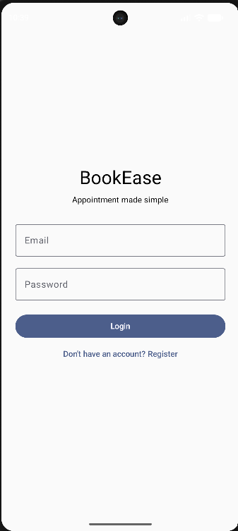
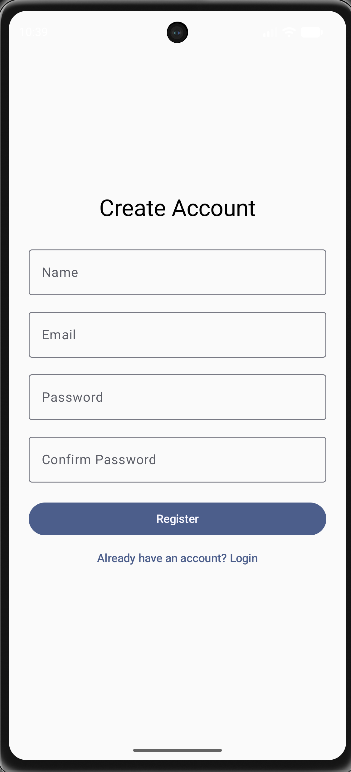
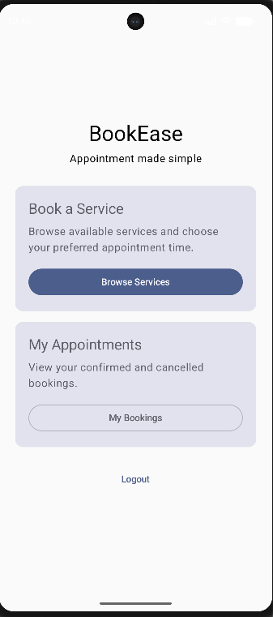
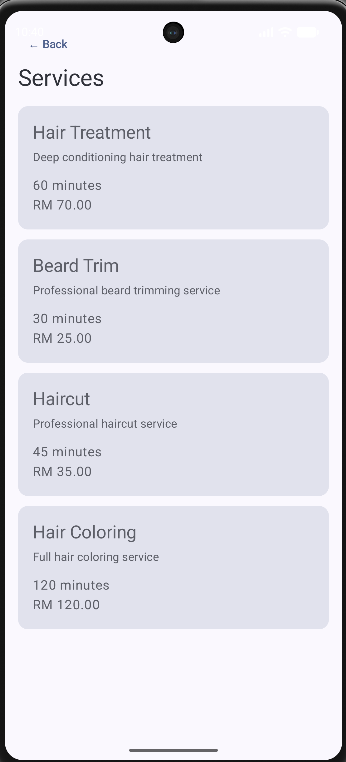
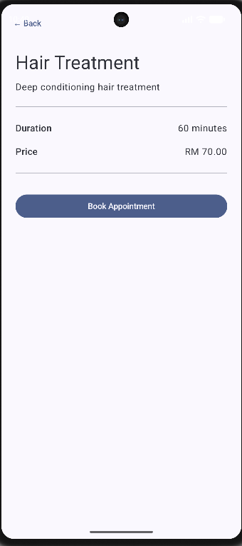
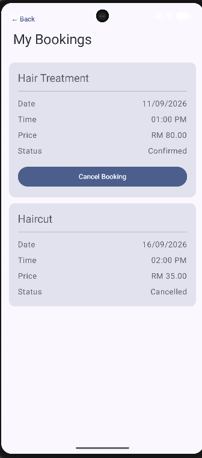
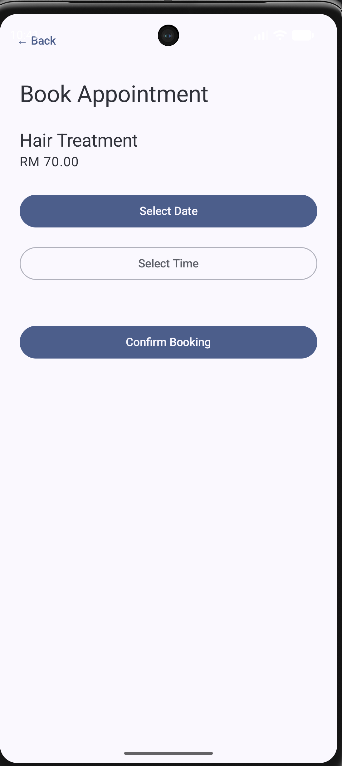
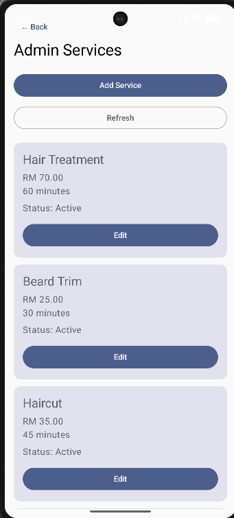
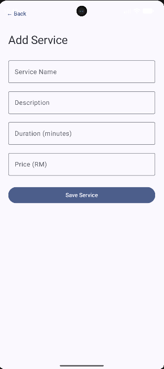
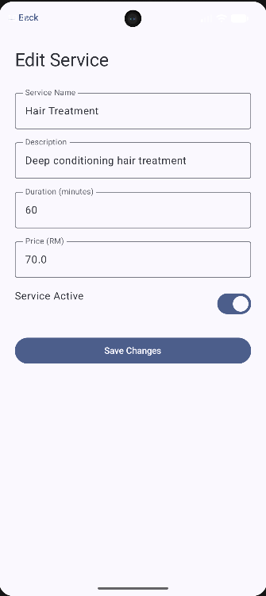

# BookEase

> Portfolio project developed to demonstrate native Android development, Firebase integration, business rule validation, role-based access control, and practical Software Development Life Cycle (SDLC) implementation.

BookEase is a native Android appointment management application developed using **Kotlin**, **Jetpack Compose**, and **Firebase**.

The application allows customers to browse available services, view service details, book appointments, manage their bookings, and cancel confirmed appointments. Administrators can manage service information through a protected admin workflow with role-based access control.

---

## Features

### Customer

- User registration and login
- Firebase Authentication
- Browse available services
- View service details
- Select appointment date and time
- Duplicate booking prevention
- View personal booking history
- Cancel confirmed bookings
- User-specific appointment access
- Persistent cloud data storage with Cloud Firestore

### Administrator

- Role-based administrator access
- Add new services
- Edit existing services
- Enable or disable services
- Manage service information
- Restricted access to admin routes
- Firestore Security Rules protecting privileged operations

---

## Technologies

### Android

- Kotlin
- Android Studio
- Jetpack Compose
- Navigation Compose

### Backend / Cloud

- Firebase Authentication
- Cloud Firestore
- Firestore Security Rules

### Software Engineering

- Repository-based architecture
- Object-oriented programming
- Input validation
- Role-based access control
- Business rule validation
- SDLC
- Git / GitHub

---

## Architecture

The project uses a repository-based structure to separate the user interface from Firebase data access and business operations.

```text
Jetpack Compose UI
        |
        v
Navigation Compose
        |
        v
Repository Layer
        |
        v
Firebase SDK
        |
        +--- Firebase Authentication
        |
        +--- Cloud Firestore
        |
        +--- Firestore Security Rules
```

### Main Responsibilities

- **UI Layer** — Handles screens, user input, loading states, validation messages, and user interaction.
- **Navigation Layer** — Controls movement between login, home, services, booking, customer, and administrator screens.
- **Repository Layer** — Encapsulates authentication, service management, appointment management, and Firestore communication.
- **Firebase Layer** — Provides authentication, cloud persistence, authorization rules, and application data storage.

---

## Project Structure

```text
com.jiayi.bookease
│
├── data
│   ├── AuthRepository.kt
│   ├── ServiceRepository.kt
│   └── AppointmentRepository.kt
│
├── model
│   ├── User.kt
│   ├── Service.kt
│   └── Appointment.kt
│
├── navigation
│   └── AppNavigation.kt
│
└── ui
    ├── LoginScreen.kt
    ├── RegisterScreen.kt
    ├── HomeScreen.kt
    ├── ServiceListScreen.kt
    ├── ServiceDetailScreen.kt
    ├── BookingScreen.kt
    ├── MyBookingsScreen.kt
    ├── AdminServiceScreen.kt
    ├── AddServiceScreen.kt
    └── EditServiceScreen.kt
```

---

## User Roles

BookEase currently supports two roles.

### Customer

All users created through public registration are assigned:

```text
role = "customer"
```

Customers can:

- Browse active services
- View service details
- Create appointments
- View only their own appointments
- Cancel their own confirmed appointments

### Administrator

Administrator access is assigned manually through Firebase by changing the user's role to:

```text
role = "admin"
```

Administrators can:

- Access the Admin Panel
- Add services
- Edit services
- Enable or disable services
- Manage service information

The application hides admin functionality from customers, and Firestore Security Rules provide an additional authorization layer.

---

## Business Rules

BookEase includes several business validation rules:

- Users must authenticate before accessing booking features.
- New public registrations receive the `customer` role by default.
- Customers can only access their own appointments.
- Only administrators can create or modify services.
- Inactive services are hidden from customer browsing.
- Duplicate confirmed bookings for the same service, date, and time are prevented.
- Cancelled appointments remain stored as booking history instead of being deleted.
- Cancelled time slots can become available for booking again.
- Customers cannot promote themselves to administrator through the application.
- Customers cannot delete appointment history directly.

---

## Firebase Data Model

### users

```text
users/{uid}

uid
name
email
role
```

Example:

```text
uid: "firebase-user-id"
name: "Test User"
email: "test@example.com"
role: "customer"
```

### services

```text
services/{serviceId}

id
name
description
duration
price
active
```

Example:

```text
id: "service-document-id"
name: "Haircut"
description: "Professional haircut service"
duration: 45
price: 35.0
active: true
```

### appointments

```text
appointments/{appointmentId}

id
userId
serviceId
serviceName
date
time
price
status
createdAt
```

Example:

```text
id: "appointment-document-id"
userId: "firebase-user-id"
serviceId: "service-document-id"
serviceName: "Haircut"
date: "12/09/2026"
time: "10:00 AM"
price: 35.0
status: "confirmed"
createdAt: 1789130000000
```

---

## Main Application Flow

### Customer Flow

```text
Register / Login
        |
        v
       Home
        |
        +----------------------+
        |                      |
        v                      v
Browse Services          My Bookings
        |                      |
        v                      v
Service Detail          Booking History
        |
        v
Book Appointment
        |
        v
Select Date & Time
        |
        v
Validate Time Slot
        |
        v
Create Appointment
```

### Administrator Flow

```text
Admin Login
    |
    v
   Home
    |
    v
Admin Panel
    |
    +--------------------+
    |                    |
    v                    v
Add Service         Edit Service
                         |
                         v
                  Enable / Disable
```

---

## Authentication

BookEase uses Firebase Authentication with email and password.

Registration workflow:

```text
Register
   |
   v
Firebase Authentication
   |
   v
Create users/{uid}
   |
   v
role = customer
   |
   v
Home
```

Passwords are managed by Firebase Authentication and are **not stored in Cloud Firestore**.

---

## Appointment Booking Logic

When a customer confirms a booking, BookEase checks Firestore for an existing appointment with the same:

```text
serviceId
date
time
status = confirmed
```

If a matching confirmed appointment exists, the booking is rejected. Otherwise, a new appointment is created.

> Note: the current implementation uses a query-before-create approach. A future improvement is to use Firestore Transactions or dedicated booking-slot documents for stronger atomic reservation handling.

---

## Appointment Cancellation

Appointments are not deleted when cancelled.

Instead:

```text
confirmed
    |
    v
cancelled
```

This preserves historical booking information and allows the application to distinguish between active and cancelled reservations.

---

## Security

Firestore Security Rules are used together with application-level role checks.

The intended access model is:

```text
Customer
- Read own profile
- Read services
- Create own appointments
- Read own appointments
- Cancel own confirmed appointments
- Cannot manage services

Administrator
- Access Admin Panel
- Add services
- Edit services
- Enable / disable services
- Read and manage protected business data
```

This provides a stronger authorization model than simply hiding administrator buttons in the UI.

---

## Software Development Lifecycle

BookEase was developed using an iterative SDLC approach.

### 1. Requirements Identification

Core requirements were defined for authentication, service browsing, appointment booking, booking history, cancellation, and administrator service management.

### 2. Data Model Design

Firestore collections were designed for users, services, and appointments.

### 3. UI and Navigation Design

The navigation flow was developed for login, registration, home, service list, service details, booking, My Bookings, and administrator management.

### 4. Authentication Implementation

Firebase Authentication was integrated using email/password login.

### 5. Cloud Database Integration

Cloud Firestore was used to persist users, services, and appointments.

### 6. Business Rule Implementation

Validation rules were implemented for required fields, password confirmation, service availability, duplicate appointment prevention, and booking cancellation status.

### 7. Role-Based Access Control

Customer and administrator roles were introduced to separate user permissions.

### 8. Security Rules

Firestore Security Rules were added to enforce data ownership and privileged service management.

### 9. Functional Testing

The main user workflows were tested through the Android emulator and Firebase Console.

### 10. UI Refinement

The interface was refined using Jetpack Compose cards, loading states, error messages, and consistent navigation.

---

## Functional Test Scenarios

| Test Case | Expected Result |
|---|---|
| Register a new user | Firebase account and customer profile are created |
| Login with valid credentials | User enters Home screen |
| Login with invalid credentials | Error message is displayed |
| Browse active services | Active Firestore services are shown |
| Open service detail | Correct service information is displayed |
| Create available booking | Appointment is stored in Firestore |
| Book same service/date/time twice | Second confirmed booking is rejected |
| View My Bookings | Only current user's bookings are shown |
| Cancel confirmed booking | Status changes to `cancelled` |
| Login as customer | Admin Panel is hidden |
| Login as administrator | Admin Panel is visible |
| Add service as administrator | New service is stored in Firestore |
| Edit service as administrator | Service data is updated |
| Disable service | Service disappears from customer service list |

---

## Screenshots

### Customer Flow

<p align="center">
  
  
  
</p>

<p align="center">
  
  
  
</p>

<p align="center">
  
</p>

### Admin Flow

<p align="center">
  
  
  
</p>

---

## Setup

### Requirements

- Android Studio
- Android SDK
- Kotlin
- Firebase project
- Android Emulator or physical Android device

### Firebase Setup

1. Create a Firebase project.
2. Register the Android application.
3. Use the same package name as the Android project.
4. Download `google-services.json`.
5. Place it inside:

```text
app/google-services.json
```

6. Enable Firebase Authentication using Email/Password.
7. Create a Cloud Firestore database.
8. Configure Firestore Security Rules.
9. Sync the Gradle project.

---

## Important Security Note

Do not commit sensitive Firebase configuration or private credentials to a public repository.

The project `.gitignore` should include:

```text
google-services.json
**/google-services.json
```

Before pushing to GitHub, verify with:

```bash
git status
```

---

## Future Improvements

- Real-time available time-slot display
- Firestore transaction-based booking
- Appointment rescheduling
- Push notifications
- Email reminders
- Administrator appointment dashboard
- Search and filtering
- Service categories
- User profile editing
- Better date/time picker experience
- Automated unit testing
- UI testing
- MVVM architecture
- ViewModel / StateFlow integration
- Dependency injection
- Improved responsive layout
- Production-ready error handling

---

## Learning Outcomes

Through this project, I gained practical experience in:

- Native Android development with Kotlin
- Jetpack Compose UI development
- Navigation Compose
- Firebase Authentication
- Cloud Firestore integration
- Repository-based application architecture
- Role-based access control
- Firestore Security Rules
- CRUD operations
- User-specific data access
- Business rule validation
- Debugging
- Functional testing
- SDLC implementation
- Git and GitHub project documentation

---

## Author

**Aw Jia Yi**  
Bachelor of Software Engineering (Honours)  
Southern University College

---

## License

This project is currently maintained as an educational and portfolio project.
